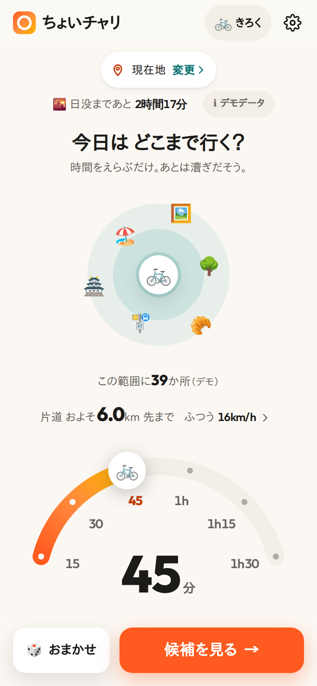
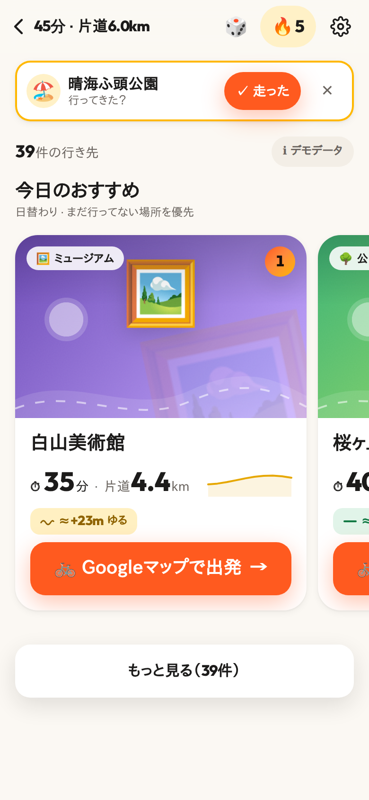
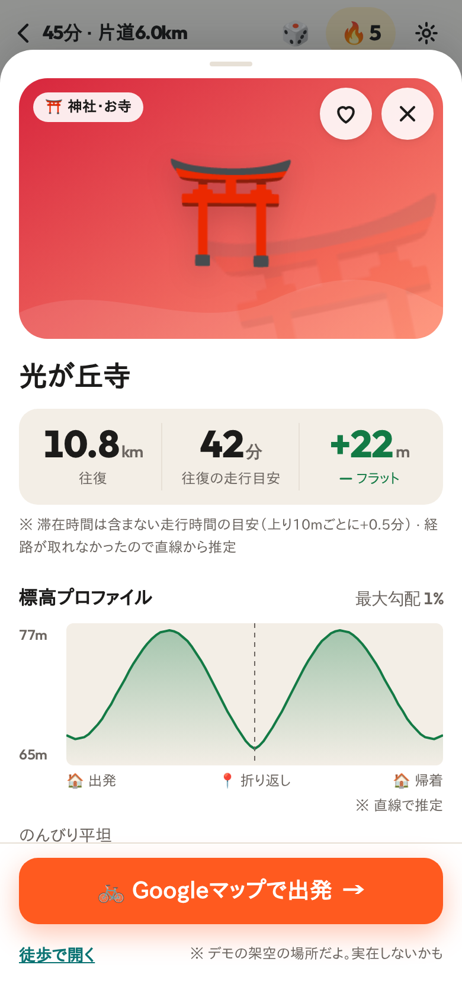

# ちょいチャリ — 時間でえらぶサイクリング

「どこに行くか決めるのが面倒」をなくすサイクリング目的地提案 PWA。
往復の時間を選ぶだけで、ちょうどいい距離の行き先（公園・展望スポット・カフェ・神社など）を写真と高低差つきで提案し、Googleマップでそのままナビを始められます。

- 時間ダイヤル（15分〜1時間30分）と速度プリセット（のんびり 12 / ふつう 16 / 速め 20 km/h）から片道の到達距離を計算
- 「今日のおすすめ」3件（日替わり・まだ行っていない場所を優先）から直接出発、残りは「もっと見る」で一覧（高低差・カテゴリで絞り込み、並び替え）
- カードには「⏱ 40分 · 片道5.4km」（走行時間の目安は 5 分単位）。距離・時間はカード・ガチャ・詳細で同じ計算（詳細で経路が取れたら一覧にも反映）
- 高低差は 🟢フラット / 🟡ゆるアップダウン / 🔴ヒルクライム（一覧は直線での推定で「≈」付き、詳細を開いて経路が取れると経路に沿って確定）
- 迷ったら「おまかせ」ガチャ
- 走った記録・連続日数・今週の目標・スタンプ帳（端末内に保存）。出発後に戻ると「行ってきた？」と聞いてくれる
- 日没までの残り時間を表示（端末内で計算）
- ホーム画面に追加して使える PWA（オフライン時は、出発地が 1km 以内なら前回の候補を表示。新しい版は「新しいバージョンがあります」から更新）

## 使い方

1. アプリを開くと現在地を取得します（許可しない場合は駅名・住所で出発地を選ぶか「デモで試す（東京駅）」）。
2. ダイヤルで往復の時間を選び「候補を見る」。
3. おすすめカードの「Googleマップで出発」をタップ（片道 / 往復は詳細で切替。既定は往復。駅名などで出発地を選んだときは、その出発地から経路を開きます）。
4. 帰ってきたら「行ってきた？」で ✓走った → スタンプとストリークが増えます。

`?demo=1` を付けるとネットワークに一切出ずにデモデータで動きます（スクリーンショット・動作確認用）。

| ホーム | おすすめ | 詳細 |
|---|---|---|
|  |  |  |

## 開発

Node.js 22.12 以上（Vite 8 / Vitest 5 の要件。CI も 22）。

```sh
npm ci
npm run dev          # 開発サーバー（http://localhost:5173/ 、?demo=1 でデモ）
npm test             # ユニット / コンポーネントテスト（Vitest, TZ=Asia/Tokyo 固定）
npm run typecheck    # 型チェック
npm run build        # 本番ビルド（dist/）
npm run preview      # ビルド結果の確認
npm run test:live    # 実 API スモーク（任意。公開 API に実際にアクセスする。CI では実行しない）
npm run icons        # public/icons/*.svg から PNG アイコンを生成（Playwright + Chromium）
npm run screenshots  # docs/screenshots/ を撮り直す（要: npm run build、Playwright + Chromium）
```

`icons` / `screenshots` は devDependency の `playwright` を使います。ブラウザは `PLAYWRIGHT_BROWSERS_PATH` にある Chromium を使うので、必要なら `npx playwright install chromium` で入れてください。

構成:

- `src/lib/` — ロジック（到達距離・高低差判定・候補選定・各 API クライアント・保存）。UI に依存しない
- `src/hooks/` — 検索・段階ロード・出発地・習慣化の状態
- `src/components/` — 画面とコンポーネント（外部 UI ライブラリなし）
- `src/styles/` — デザイントークン（`tokens.css`）とコンポーネントごとの CSS
- `docs/` — PRD / DESIGN / BACKLOG / スクリーンショット

## デプロイ（GitHub Pages）

`.github/workflows/deploy.yml` が `main` への push（または手動実行）で `npm ci → npm test → BASE_PATH=/cycling-route-finder/ npm run build` を行い、`dist/` を GitHub Pages に公開します。

- リポジトリの Settings → Pages → Source を「GitHub Actions」にしてください。
- サブパス以外で配信する場合は `BASE_PATH` を変えるだけです（既定は `/`）。manifest の `start_url` / `scope` は相対 `./` なのでどの base でも動きます。

## 使用 API とクレジット

ランニングコスト 0 で動くよう、API キー不要の無料公開 API だけを使っています。検索結果は端末内にキャッシュし（7日）、経路は詳細を開いたときだけ取得するなど、アクセスは最小限にしています。

| 用途 | API | クレジット / ライセンス |
|---|---|---|
| 行き先（POI） | [Overpass API](https://wiki.openstreetmap.org/wiki/Overpass_API)（overpass-api.de ほか） | © OpenStreetMap contributors（ODbL） |
| 標高 | [Open-Meteo Elevation API](https://open-meteo.com/en/docs/elevation-api) | Elevation data: Open-Meteo（CC BY 4.0） |
| 経路（自転車） | [routing.openstreetmap.de](https://routing.openstreetmap.de/)（OSRM） | Routing: FOSSGIS e.V. / © OpenStreetMap contributors |
| 写真 | [Wikidata](https://www.wikidata.org/)（Query Service で P18 のみ）/ [Wikimedia Commons](https://commons.wikimedia.org/) | 写真ごとに作者・ライセンスを表示（近くで撮られた写真は「付近の写真」） |
| 地名検索 | [Nominatim](https://nominatim.org/)（確定時のみ・1 秒 1 件） | © OpenStreetMap contributors |
| ナビ | Google マップ（[Maps URLs](https://developers.google.com/maps/documentation/urls/get-started) で開くだけ） | — |
| 数字フォント | [Outfit](https://fonts.google.com/specimen/Outfit)（同梱） | SIL Open Font License 1.1 |

すべてのクレジットはアプリの「設定」にも表示しています。

## 非商用であること

本アプリは個人の**非商用**プロジェクトです。広告・課金・有料機能はありません。Open-Meteo の無料枠（非商用利用）をはじめ、各 API の利用規約・利用上の注意の範囲で利用しています。商用で使う場合は各 API の有償プラン・自前ホスティング等を検討してください。

## プライバシー

- アカウント・サーバー・解析ツール・広告はありません。
- 位置情報は端末の中で使い、候補さがしに必要なぶんだけ**丸めた座標**を上記の公開 API に送ります（Overpass は約 1km 単位のグリッド、標高・経路は約 11m 単位、地名の逆引きは約 100m 単位）。
- Google マップには、出発ボタンを押したときだけ目的地（往復のとき・出発地を手動で選んだときは出発地も）を URL で渡します。
- 走った記録・お気に入り・設定・検索キャッシュはこの端末（localStorage / IndexedDB）にだけ保存されます。ブラウザのサイトデータを消すと削除されます。
